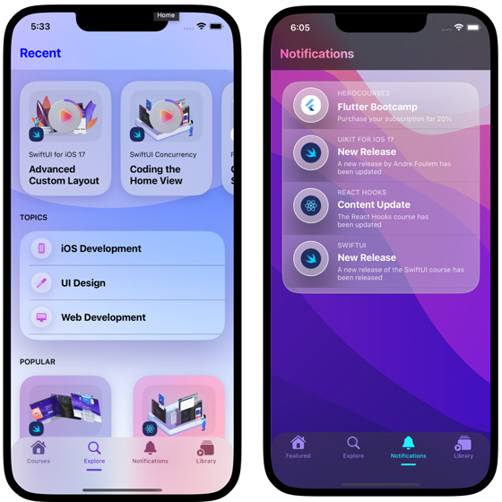

<!-- PROJECT LOGO -->
 

    

  <h3 align="center">CourseHero iOS App</h3>

  

    A Course Portofolio built in UIKit with Firebase + Firestore.
  

<!-- ABOUT THE PROJECT -->

#

## About The Project

### Project Focus: CourseHero's goal is to implement an app with UIKit with navigation and data. Firebase is used for authentication and In-App notifications.

#

### Built With

<!-- ROADMAP -->

## Roadmap

- [x] Integrate visual assets.
- [x] Build main navigation with sheets and tab bar.
- [x] Implement notifications with Firebase.
- [x] Implement fuzzy search.
- [x] Present data.

<!-- CONTACT -->

## Contact

André Foulem - [MyTwitter](https://twitter.com/andreincolors) - [LinkedIn](https://www.linkedin.com/in/andr%C3%A9-foulem-845087244/)
